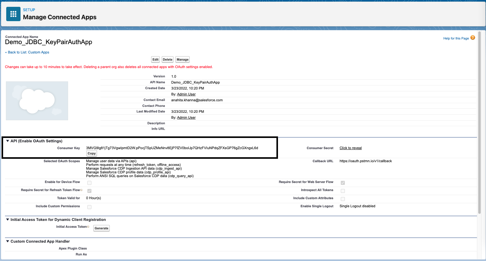

# Salesforce-CDP-jdbc
The Salesforce CDP Java Database Connectivity (JDBC) driver allows for a JDBC connection to the Salesforce CDP ANSI SQL API. This connection lets you access and retrieve data using your favorite tools that are supported by JDBC.

# How to use:
The JDBC driver can be used with the tools like Tableau, DBeaver or independently with any Java JDBC client to connect to Salesforce CDP and retrieve the data.

Get the Driver from this repo.

# Connected App
To use JDBC driver, admins will have to create a connected app in the Salesforce org. Please follow the steps mentioned in Salesforce CDP setup in below link to create a connected app. 
If you create a connected app using below link, you need not pass client Id and secret mentioned in the code examples below. Or else please pass client Id and secret.

https://extensiongallery.tableau.com/connectors/270

Alternatively, if you want to use key pair authentication instead of username and password, please follow the below steps to generate a key pair and configure certificate with your connected app.

### Create a Private Public Key Pair and a Digital x509 Certificate
Open terminal and change directories to any folder and run the following commands:

#### 1. Create a private public key pair
```
openssl genrsa -out keypair.key 2048
```
#### 2. Create a digital certificate from the key pair
```
openssl req -new -x509 -nodes -sha256 -days 365 -key keypair.key -out certificate.crt
```
> **Note:** There will be a series of questions (Country, State, Org Name, etc) you need to complete.
#### 3. Create pkcs8 private key from the key pair
```
openssl pkcs8 -topk8 -nocrypt -in keypair.key -out private.key
```


> This creates keypair.key, private.key and certificate.crt files in that folder. Files private.key and certificate.crt will be used later in the setup.
### Connected App Setup

This flow utilizes Salesforce's server to server [JWT bearer flow](https://help.salesforce.com/articleView?id=remoteaccess_oauth_jwt_flow.htm&type=5) for acquiring an access token. This portion of the setup will walk you through setting up the connected app.

**Note:** For more detailed instructions, please visit: [Create a Connected App](https://help.salesforce.com/s/articleView?id=sf.connected_app_create.htm&type=5)
1. Login to Salesforce → Setup and Search "**App Manager**"
2. In the Setup’s Quick Find search "**App Manager**"
3. Select **“New Connected App”**
    1. Connected App Name: CDP API
    2. API Name: CDP_API (or whatever default value is pre-populated)
    3. Contact Email: Your email address
    4. Under API Heading, check the box for **“Enable OAuth Settings”**
    5. Callback URL: https://oauth.pstmn.io/v1/callback \
   **Note:** You can use your own callback url, which is nothing but the endpoint where redirect will happen after successful authorization.
    6. Select the checkbox for **“Use digital signatures”**
    7. Select **“Choose File”** and select the **certificate.crt** file created in [Create a Private Public Key Pair and a Digital x509 Certificate](#Create-a-Private-Public-Key-Pair-and-a-Digital-x509-Certificate) section
    8. Under **“Selected OAuth Scopes”** move the following from the “Available OAuth Scopes” to “Selected OAuth Scopes”
       1. Manage user data via APIs (api)
       2. Perform requests at any time (refresh_token, offline_access)
       3. Perform ANSI SQL queries on Salesforce CDP data (cdp_query_api)
       4. Manage Salesforce CDP profile data (cdp_profile_api)
       5. Note: feel free to select others if needed. \
   Your screen should look similar to this
       
    9. Select **Save** (on the next screen select **Continue**)
    10. Make note of the **Consumer Key** value. This will be used as the **“clientId”** variable for establishing connection. \
   
4. At the top of your newly created connected app click “Manage”
   1. Select **“Edit Policies”**
   2. Change **“IP Relaxation”** to **“Relax IP restrictions”**
   3. Select **Save**
5. In Setup search for **"OAuth and OpenID Connect Settings"**
   1. Turn on **"Allow OAuth Username-Password Flows"**


## App Authorization

At this point your connected app has been configured however there is a ***_one time setup requirement_*** to authorize your user with the connected app.

The URL format will look like:

```
<YOUR_ORG_URL>/services/oauth2/authorize?response_type=code&client_id=<YOUR_CONSUMER_KEY>&scope=api refresh_token cdp_profile_api cdp_query_api&redirect_uri=<YOUR_CALLBACK_URL>
```
>Notice the scope parameter in the above URL. ***It’s important that you select all the required custom CDP scopes in this request***. All further JWT bearer flow requests will honor ONLY these scopes

**YOUR_ORG_URL** is the fully qualified instance URL.


**YOUR_CONSUMER_KEY** is the consumer key noted in step 3.x above.

**Example URL:**
>https://querycdp2test-dev-ed.lightning.force.com/services/oauth2/authorize?response_type=code&client_id=asdlfjasldfjsaldfjaslfds&scope=api%20refresh_token%20cdp_profile_api%20cdp_query_api&redirect_uri=https://oauth.pstmn.io/v1/callback

1. Paste that URL in a browser window.
2. This prompts a consent dialog asking permission for each of the scopes requested above.  Select **Allow** and you should be redirected back.

   

3. You may also get an alert from the callback. If you do, select **Open Postman**

   

4. **Optional:** If you want to verify everything is authorized correctly, in the Quick Find search for **“Connected Apps OAuth Usage”**. Here you will see your connected app and should see a user count of 1.

   

# Java Code
Load the Driver into your Java classPath

Create Connection with oAuth tokens
```
   Class.forName("com.salesforce.cdp.queryservice.QueryServiceDriver");
   Properties properties = new Properties();
   properties.put("coreToken", <Core oAuth token>);
   properties.put("refreshToken", <Refresh Token>);
   properties.put("clientId", <Client Id of the connected App>);
   properties.put("clientSecret", <Client Secret of the connected App>);

   Connection connection =  DriverManager.getConnection("jdbc:queryService-jdbc:https://login.salesforce.com", properties);
```
Create Connection with UserName and Password

```
Class.forName("com.salesforce.cdp.queryservice.QueryServiceDriver");
   Properties properties = new Properties();
   properties.put("user", <UserName>);
   properties.put("password", <Password>);
   properties.put("clientId", <Client Id of the connected App>);
   properties.put("clientSecret", <Client Secret of the connected App>);
   

   Connection connection =  DriverManager.getConnection("jdbc:queryService-jdbc:https://login.salesforce.com", properties);
```

Create Connection with UserName, ClientId and Private Key (Key Pair authentication) 

```
Class.forName("com.salesforce.cdp.queryservice.QueryServiceDriver");
   Properties properties = new Properties();
   properties.put("user", <UserName>);
   properties.put("clientId", <Client Id of the connected App>);
   properties.put("privateKey", <Private Key string corresponding to the digital x509 certificate configured in the connected App>);
   

   Connection connection =  DriverManager.getConnection("jdbc:queryService-jdbc:https://login.salesforce.com", properties);
```

Create Statements/ Prepared Statements to execute Query and get ResultSet
```
PreparedStatement preparedStatement = connection.prepareStatement("select FirstName__c, BirthDate__c, YearlyIncome__c from Individual__dlm where FirstName__c = ? and YearlyIncome__c > ?");
   preparedStatement.setString(0, "Angella");
   preparedStatement.setInt(1, 1000);

ResultSet  resultSet = preparedStatement.executeQuery();

while (resultSet.next()) {
       log.info("FirstName : {}, BirthDate__c : {}, YearlyIncome__c : {}", resultSet.getString("FirstName__c"), resultSet.getTimestamp("BirthDate__c"), resultSet.getInt("YearlyIncome__c"));
```


# Python Code
The JDBC driver can also be used with python. We need JaydebeAPI wrapper on top of the JDBC driver to call JDBC methods.

Install JaydebeAPI using PIP
```
pip install JayDeBeApi
```
Sample Python Code

```
import jaydebeapi

// Sample properties with username and password flow.
properties = {
    'user': "<UserName>",
    'password': "<Password>",
    'clientId': "<Client Id of the connected App>",
    'clientSecret': "<Client Secret of the connected App>"
}

// Sample properties with key-pair authentication flow.
properties = {
    'user': "<UserName>",
    'clientId", "<Client Id of the connected App>",
    'privateKey': "<Private Key string corresponding to the digital x509 certificate configured in the connected App>"
}

// Sample properties with oAuth (User agent) flow.
properties = {
    'coreToken': "<CoreToken>",
    'refreshToken': "<Refresh Token>",
    'clientId", "<Client Id of the connected App>",
    'clientSecret", "<Client Secret of the connected App>"
}


conn = jaydebeapi.connect("com.salesforce.cdp.queryservice.QueryServiceDriver", "jdbc:queryService-jdbc:https://login.salesforce.com", properties, "<Complete Path to JDBC driver>")

curs = conn.cursor()
curs.execute('SELECT * FROM ssot__Individual__dlm')
data = curs.fetchall()
```

# Notes:
    
    Add order by clause in the query to fetch the paginated results for V1 API.
